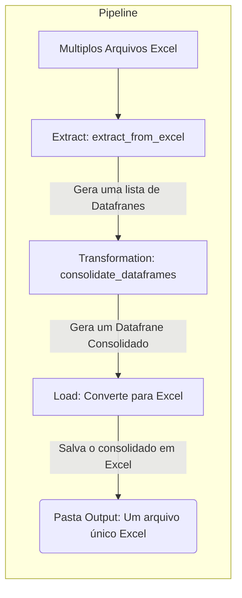

# Doc ETL join Excels

## Descrição

O projeto em unificar planilhas xlsx em uma única.

## Fluxo

## ETL

### ::: app.etl.extract

### ::: app.etl.load

### ::: app.etl.transform

### ::: app.etl.pipeline
